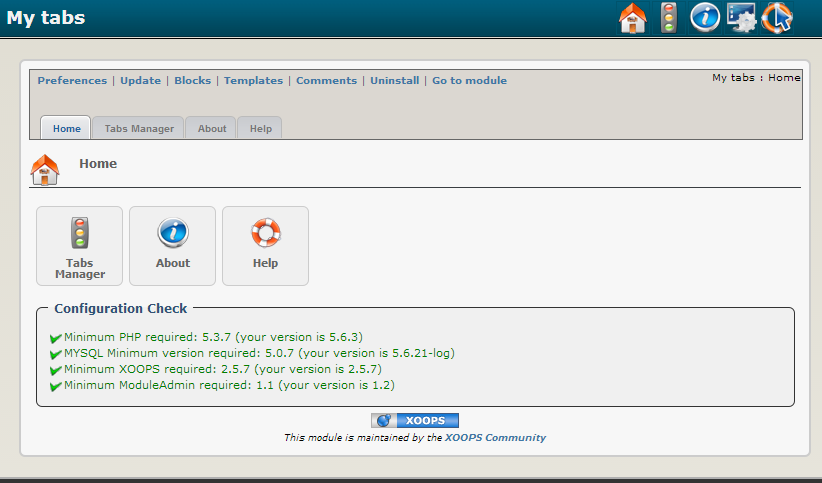

# Introduction

## Module MyTabs

#### for XOOPS 2.5.7

### User Manual

© 2018 XOOPS Project \([https://xoops.org](https://xoops.org)\)

### Module Purpose

The **MyTabs** module is a revolutionary [XOOPS](http://www.xoops.org) Module developed by Ricardo Costa \(Trabis\) from Portugal, which can:

* Create any blocks you want \(just clone the original\)
* Create any pages \(holders for tabs\) you want so you can choose in the block what page to show
* Create any tabs you want per page
* Create any blocks you want per tabs
* Set group view permissons per block/page, tab and block
* Set time based tabs and blocks \(auto-expiring\)
* Choose from 5 diferent page/block layouts
* Use how many blocks you want in the same page or not \(just clone and set them\)
* Many other goodies like cache, position, scroll, width, etc

  You can create your own .css for tabs. Just upload it to css folder and it will be available for selection in your blocks!

  
_Figure 1: Main view of the MyTabs Module \(Admin side\)_

### Download/Fork the Module 

**You can fork the module --&gt;** [**here**](https://github.com/XoopsModules25x/mytabs)**\)**

### How to Contribute

[You can contribute on GitHub](https://github.com/XoopsDocs/mytabs-tutorial). Changes will be [pushed to Gitbook.io automatically](https://www.gitbook.com/book/xoops/mytabs-tutorial/activity) when the [main repository](https://github.com/XoopsDocs/mytabs-tutorial) changes.

Editing the book can be done either by updating the markdown files with a text editor, or opening the repository in [the Gitbook desktop app](https://github.com/GitbookIO/editor/blob/master/README.md). The desktop app will give you a live preview option.

## Table of Content

* [Install/Uninstall](install-uninstall.md)
* [Administration Menu](administration-menu.md)
* [Preferences](preferences.md)
* [Operating Instructions](operating-instructions.md)
* [The User Side](the-user-side.md)
* [Blocks](blocks.md)
* [Templates](templates.md)
* [Miscellaneous](https://github.com/xoops/xoops-mytabs-module-tutrial/tree/46ba1bd18c5488abf1e9cc134b00cc07e0a886c8/en/book/8other.md) 
* [Module Credits](module-credits.md)
* [About XOOPS CMS](about-xoops-cms.md)

### License:

  
Unless specified, this content is licensed under a [Creative Commons Attribution-NonCommercial-ShareAlike 4.0 International License](http://creativecommons.org/licenses/by-nc-sa/4.0/).

All derivative works are to be attributed to XOOPS Project \([www.xoops.org](https://xoops.org)\)

