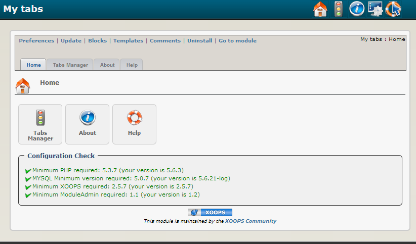
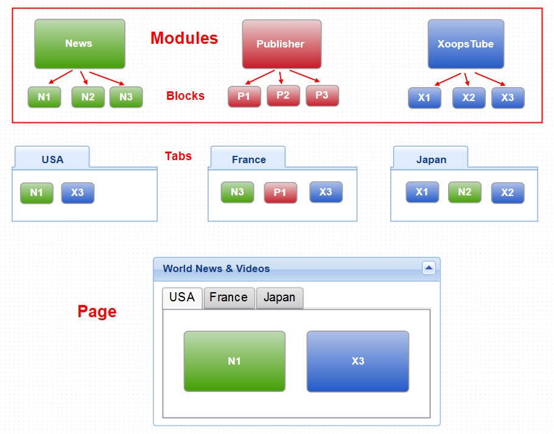

# 2.0 Administration Menu

  

*Figure 1: Main view of the MyTabs Module (Admin side)*

To better understand the module and its purpose, let's take a look at the following diagram:

  
*Figure 1: Architecture of MyTabs Module*

Pretty much all XOOPS modules have Blocks, that can be used to provide specific information from the module, and can be placed in different locations of the theme.

While we can assign them to different module pages, i.e. they can be visible when a particular module to which they are linked, is active in the Front Page, they have to be managed and assigned individually, which is sometimes time consuming. 

Trabis came with the brilliant idea to use the blocks the same way as we would use Lego blocks, where we can place various blocks inside a container, and then manage this container separately, regardless of what's inside of it.

The container for all the blocks is a Tab. 

And going up to the next level, we could use Page as container for various Tabs. 

In this example we'll build a "**World News & Videos**" with Tabs representing different countries, and each Tab containing blocks from different modules, but related to each other by the topic of the Tab, in our case: different countries.

In order to create such a structure, we start from the top, i.e. 

1. we create a Page (here: World News) 
2. then for this Page we create and assign one or more Tabs (here: USA, France, Japan)
3. then for each Tab we select and assign existing Blocks
 
Now that we understand better the idea behind MyTabs and its architecture, we can apply this in practice and build our "**World News & Videos**" Portal!  

