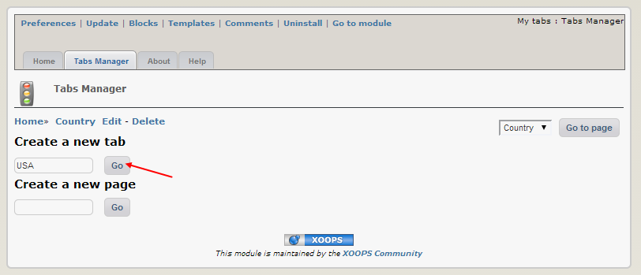
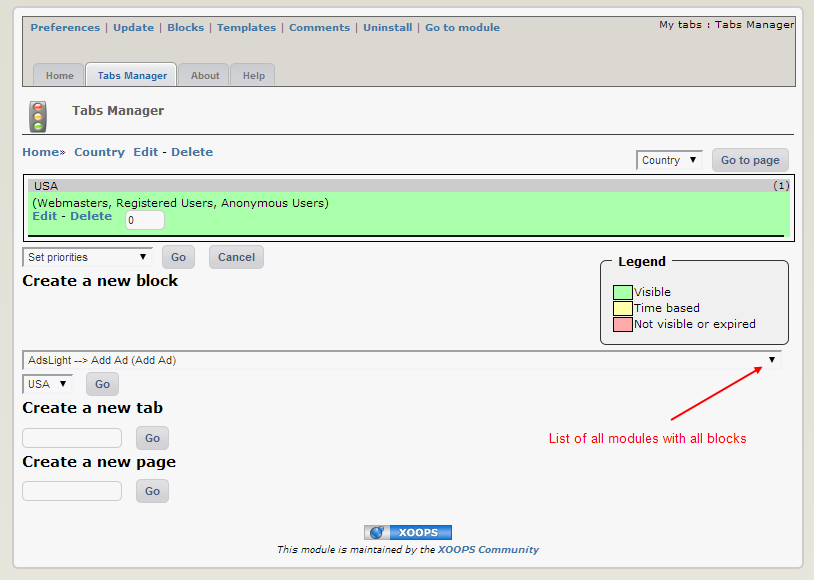
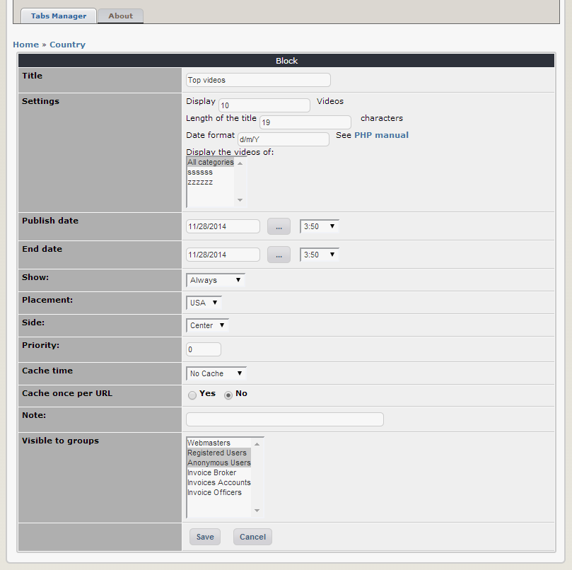
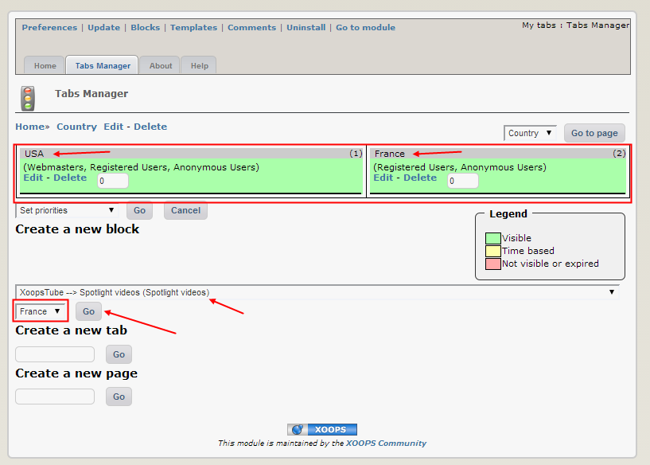
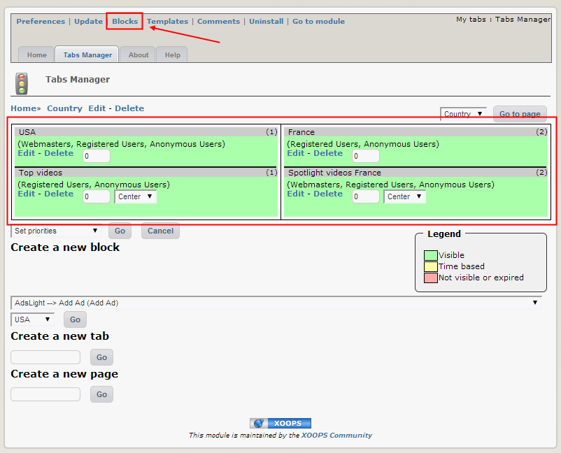

# 4.0 Operating Instructions

## Creating a Page

  
*Figure 2: Creating new page*
 
Click on “Go”, and a new screen appears:

  
*Figure 2: Creating new page*

Click on Save, and a new screen appears:

  
*Figure 2: Creating new page*

## Creating a Tab

  
*Figure 2: Creating new page*

Now, you have an option to create your first Tab. Type “USA” and click “Go”. A screen with preferences for this new Tab will appear:

  
*Figure 2: Creating new page*

 
Make adjustments, as needed, and click on “Save”. Now you’re back to your first screen, but it has now options to add blocks to your newly created Tab. 
 
## Adding Blocks

  
*Figure 2: Creating new page*

  
*Figure 2: Creating new page*
 
I select “Top Videos” block from the “XoopsTube” module, keep my Tab as “USA” (I didn’t create any other Tabs yet), and click on “Go”. A new screen with preferences for this block appears, and I can make adjustments there: 

  
*Figure 2: Creating new page*
 
Once done, I click on Save.
Let repeat it again – creating a new Tab “France” and adding there a block for “Spotlights”. Once done, I’ll have following screen:

  
*Figure 2: Creating new page*

  
*Figure 2: Creating new page*

Now, let’s make changes to the appearance of “MyTabs”. Let’s click on the “Blocks” Link on top. The following screen appears:

  
*Figure 2: Creating new page*

Let's open this block so we can modify some of the parameters:

  
*Figure 2: Creating new page*
 
Here I can adjust the position of the MyTabs, as well as the visibility and permission to which Groups.  If I want to change the appearance (e.g. what Tabs I want to use, and how fast should they scroll, I click on the “Edit” in the “Action” column.

Here I can select the layout of the Tabs, the Height of MyTabs, and the speed of the Tabs scrolling (Delay). Click on “Submit” and you’re done.

Now we can go to the User Side and check out the results of our design...

