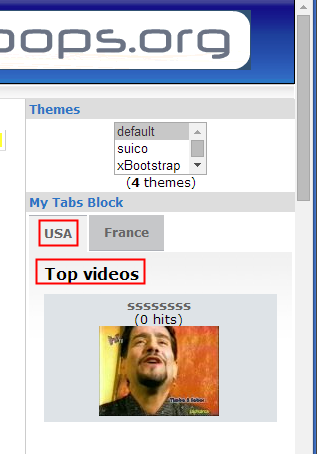

# The User Side

After we have finalized "Our Tabs", we can now go to the Front End, and see our Tabs from the user perspective:

  
_Figure 2: Creating new page_

As you remember, we have created two Tabs, one for USA, and one for France, and we have posted

| USA | France |
| --- | --- |
| Top Videos | Spotlight Videos |

  
_Figure 2: Creating new page_

As we can see here, MyTabs allows you to create endless combinations of Blocks from installed modules, and mix them as you want.

